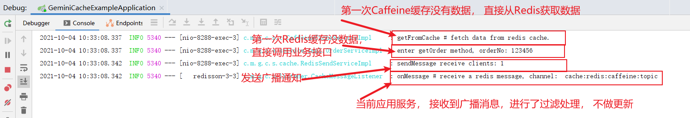

### 一、 设计目的

1. 支持Spring Boot 服务下，Redis + Caffeine的高性能分布式缓存的实现。
2. 减少应用服务的集成接入成本，快速实现缓存， 通过AOP方式拦截处理， 不侵入原业务逻辑。
3. 支持多种功能特性，如异步、超时（全局/单条控制）、压缩等，满足各种业务场景需要。

### 二、 服务结构


1. 应用服务通过集成GEMINI-CACHE缓存组件， 实现对应用服务接口的缓存功能，内部通过AOP机制做拦截处理， 不侵入业务逻辑， 支持一级、二级缓存的保存、更新与删除，以及实现分布式缓存的同步功能。
2. 一级缓存采用Redis集群/单机实现，通过强大的Redisson组件做封装处理， 支持按业务类别分类缓存设计，支持全局超时以及具体某条数据的超时控制，内部支持高性能的序列化组件以及压缩组件的处理。
3. 二级缓存采用Caffeine做实现，Caffeine是高性能的本地缓存组件，功能全面， 支持多种配置，支撑各种应用场景，实现了Caffeine多节点与Redis的缓存同步处理。
4. 针对实时性要求较高的场景，提供二种方案， 第一种是通过特定的注解标记， 加在更新操作接口中， 实现缓存的更新；第二种是可以采用监听kafka+canal数据源， 这种方案对业务无感知，后期再做设计实现。


### 三、设计实现：

Ⅰ. 现有功能设计实现：
   

  主要实现说明：

  A) 如何实现数据的缓存？

    1. 通过AOP方式对接口层进行拦截，不侵入原有接口处理逻辑。

    2. 根据配置的规则， AOP判断哪些接口需要做缓存处理。

    3. 解析入参对象，根据注解传入的参数确定缓存的key值， 为提升效率，支持SHA算法标记key值。
    4. 根据缓存key，首先查找二级缓存（Caffeine）信息，如果存在， 直接返回数据，如果不存在， 则查询一级缓存Redis，如果存在，则同步更新至Caffeine二级缓存。
    5. 如果进入一级缓存Redis不存在， 则调用原有方法处理， 并将处理结果放置一级缓存， 同时放置二级缓存，再发送广播， 通过Redis的Pub/Sub机制， 让其他节点同步更新缓存。

  B) 如何处理实时性要求较高的场景？

    1.  在新增/修改的地方， 增加CachePut或CacheDelete注解，该注解会采用广播方式，通知其他节点对一级/二级缓存进行强制更新。（此种方式需要确保注解增加到所有更新操作的接口。）

  C) 如何保障分布式缓存的一致性？

    1. 实现机制：先更新一级Redis的缓存， 再更新二级Caffeine缓存， 查询的时候， 先查询二级缓存， 再查询一级缓存， 即便二级缓存Caffeine更新失败，会查询一级缓存， 然后再更新二级缓存。 那么问题来了， 如果缓存数据在过程当中出现了变化， 是否会产生不一致？ 不会， 因为是通过Redis的PUB/SUB机制，收到消息后会直接清除二级缓存（并非直接修改），查询的时候二级缓存不存在， 则会从一级缓存中重新加载最新数据。但是在极端情况下（应用服务宕机、网络抖动）， Redis的PUB/SUB机制是无法保障消息的可靠性，可以设定Caffeine缓存的有效期来保障（即便未能及时更新， 也只是短暂影响）， 后续会接入专业的消息队列来保障消息的可靠性。

  D) 如何保障高效的性能？

    1. 支持操作线程池与缓存连接池，以及底层通过Netty连接，能够较大提升缓存操作性能。
    2. 支持异步， 键值SHA，数据序列化压缩，通过请求合并，LUA脚本， 进一步提升缓存性能。
    3. 采用高性能的Caffeine作为二级缓存库，基于Java8的高性能缓存库，提供最佳的命中率。

  


Ⅱ. 后期功能规划设计：
   

1. 后期通过AOP拦截， 可以支持热点监测机制，对于调用比较频繁的接口，在一定时间窗内做统计， 并将该接口纳入缓存控制。实现自动化的热点缓存处理， 可以防止突发峰值请求，造成某些接口负荷压力过大，保障系统的性能与稳定性。

2. 在缓存实时性同步方案上， 通过Kafka+Cannal方式监听数据源进行更新， 这种方式对业务方无感知， 每个应用服务节点， 开启对业务数据源变化的监听，每个节点监听1个partition分区，提升并发消费能力，partition分区应根据ID进行取模， 确保每条数据都落至相同的partition分区， 不会造成顺序错乱问题。如果检测发现数据产生变化， 则需要清理该表所涉及的缓存信息，从而保障缓存的实时性与一致性。

### 四、使用说明

1. POM增加依赖：

   直接引入gemini-cache组件

   ```xml
   <dependency>
       <groupId>com.mirson</groupId>
       <artifactId>gemini-cache</artifactId>
       <version>${gemini.cache.version}</version>
   </dependency>
   ```

2. 工程配置

   ```properties
   # Redis 缓存配置信息
   app.cache.enable: true
   # 是否开启二级缓存（开启Caffeine）
   app.cache.enableSecondCache: true
   # Redis线程池最大连接数（默认为16）
   app.cache.redis.executor.maxPoolSize: 16
   # Redis线程池核心连接数（默认为8）
   app.cache.redis.executor.corePoolSize: 8
   # Redis线程池线程空闲存活有效时间（单位：秒， 默认30秒）
   app.cache.redis.executor.aliveTime: 30
   # Redis线程池线程池队列大小（默认1000）
   app.cache.redis.executor.queueCapacity: 1000
   # Redis连接池最大数量
   app.cache.redis.pool.maxSize: 100
   # Redis连接池最小空闲连接
   app.cache.redis.pool.minIdleSize: 10
   # Redis缓存全局超时时间（单位：秒）
   app.cache.redis.global.expire: 60
   # Redis连接池最大等待时间
   app.cache.redis.pool.maxWaitMills: 3000
   # Redis单机连接地址 （单机与集群方式二选一，优先单机）
   app.cache.redis.host: 127.0.0.1
   # Redis单机连接端口
   app.cache.redis.port: 6379
   # Redis 集群连接地址信息 （单机与集群方式二选一，优先单机）
   #app.cache.redis.clusterNodes: 10.10.20.101:7000,10.10.20.101:7001,10.10.20.102:7000,10.10.20.102:7001,10.10.20.103:7000,10.10.20.103:7001
   # Redis连接密码
   #app.cache.redis.password: Redis1234{}
   # Redis连接池超时时间（单位：毫秒， 包括连接与读取超时时间）
   app.cache.redis.pool.timeout: 3000
   # Redis数据库编号（单机方式才生效）
   app.cache.redis.database: 7
   # Redis存储， 是否开启压缩模式
   app.cache.redis.useCompression: true
   # caffeine缓存超时时间（建议与业务数据的TTL超时时间一致）
   app.cache.caffeine.expireAfterWrite: 30000
   # caffeine 初始化缓存大小（默认为0， 不限制）
   app.cache.caffeine.initialCapacity: 0
   # caffeine 最大缓存大小（默认为0， 不限制， 建议设定一个阈值，保护jvm内存）
   app.cache.caffeine.maximumSize: 0
   ```

3. 实际使用

   在需要缓存的接口上， 增加对应注解， 比如某个查询接口：

   ```java
   /**
        * 根据订单编号获取订单信息
        * @param orderNo
        * @return
        */
   @Cacheable(cacheName = "gemini_cache_order", keyExpression = "#param1", TTL = 10)
   @Override
   public String getOrder(String orderNo){
       log.info("enter getOrder method, orderNo: " + orderNo);
       return "get order, orderNo: " + orderNo;
   }
   ```

   具体说明：

   cacheName： 是缓存的名称，并非缓存key值，不同业务可以采用不同的缓存名称区分。

   keyExpression：缓存的key值，代表具体某一条缓存的key， 支持Spring EL表达式，param1代表的第一个参数对象，如果要指向内部的属性，配置为param1.属性名， 如param1.orderNo。

   TTL：是缓存的生命周期，单位是秒， 默认是0， 代表无限周期。

   isAsync:  代表是否开启异步方式保存缓存信息， 建议可以开启，提升业务处理效率。

   keyGenerator: 是key值的生成器，默认是采用SHA算法， 标记KEY的唯一性， 提升处理效率， 但不易读。

4. 实时缓存同步

   要实现缓存的同步处理， 需要在新增/修改/删除接口，增加对应的注解，保障分布式缓存能够及时更新处理。

   但需要确保注解覆盖到所有相关的操作接口，如有遗漏， 缓存不会及时更新或出现不一致。

   ```java
   /**
        *  更新订单信息
        * @param orderNo
        * @return
        */
   @CachePut(cacheNames = "gemini_cache_order", keyExpression = "#param1", TTL = 10)
   @Override
   public String updateOrder(String orderNo){
       log.info("enter updateOrder method, orderNo: " + orderNo);
       return "get order, update orderNo: " + orderNo;
   }
   ```

5. 测试验证

   1）第一次请求：

   
   查看控制台输出：
   

   2）第一次请求：

   

   控制台不会有任何输出， 直接从Caffeine获取缓存数据。这里caffeine设定的缓存时间为30S时间，Redis的全局超时缓存为60S。

   3）调用更新接口：

   

   调用更新接口后， 输出了“update orderNo” 的信息，再次调用查询接口：
   
   
   可以看到， 数据及时进行了更新处理。